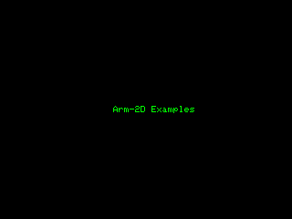
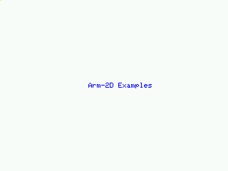

# README

## 1. Default Examples 

### 1.1 Alpha-blending

**PROJECT:    alpha-blending**

It is an **ALL-IN-ONE** example that demonstrates almost all the features provided by the library. It is also used as a benchmark of Arm-2D. Since there is no public benchmark available for micro-controllers, we decide to overcome this problem with the following methods and considerations:

- **Choose the widely used algorithms in embedded GUI as the body of the benchmark**
  - Alpha-blending
  - Image Copy
  - Texture Paving
- **Simulate a typical application scenario with sufficient complexity**
  - Background with Texture paving (switching different mirroring modes every 4 second)
  - Foreground picture 
  - Two constructed layers for alpha-blending and texture paving
  - Moving icons
  - Spinning busy wheel
- **Choose a typical low-cost LCD resolution 320*240 in RGB565**
- **Let those layers float with different angles and speed to cover a sufficient number of conditions.**
- **Record the cycle count used for blending one frame and run 1000 iterations (frames).** 

**Figure 1-1 A snapshot of alpha-blending demos running on MPS3 platform**

  

- **Use the average cycle count in 1000 iterations as benchmark score.**

  - Based on that, for typical embedded application requirement, we derive a more meaningful metrics called the **Minimal Frequency Required for 30 FPS (MHz)** as shown in **Figure 1-5**. 

  

**Figure 1-2 Performance Comparison among some Cortex-M processors**

  

### 1.2 Partial-Frame-Buffer

**PROJECT:    partial_frame_buffer**

The visual effects is the same as Alpha-blending but using Partial-Frame-buffer scheme.

## 2 Extended Examples

### 2.1 Simple Progress Bar

**PROJECT:    \[progress-bar-01\]\[bare-metal\]\[pfb\]**

A bare-metal example using Partial-Frame-Buffer scheme shows how to build a simple progress bar using only Arm-2D APIs. 

**Figure 2-1 A simple progress bar**

 

### 2.2 A Progress Bar with A Shitting Effect

**PROJECT:    \[progress-bar-02\]\[bare-metal\]\[pfb\]**

A bare-metal example using Partial-Frame-Buffer scheme shows how to build a progress bar with a shifting effect using only Arm-2D APIs. 

**Figure 2-2 A Progress Bar with A Shifting Effect**

 

### 2.3 A Progress Bar with A Waving Pulse Effect

**PROJECT:    \[progress-bar-03\]\[bare-metal\]\[pfb\]**

A bare-metal example using Partial-Frame-Buffer scheme shows how to build a progress bar with a waving pulse effect using only  Arm-2D APIs.

